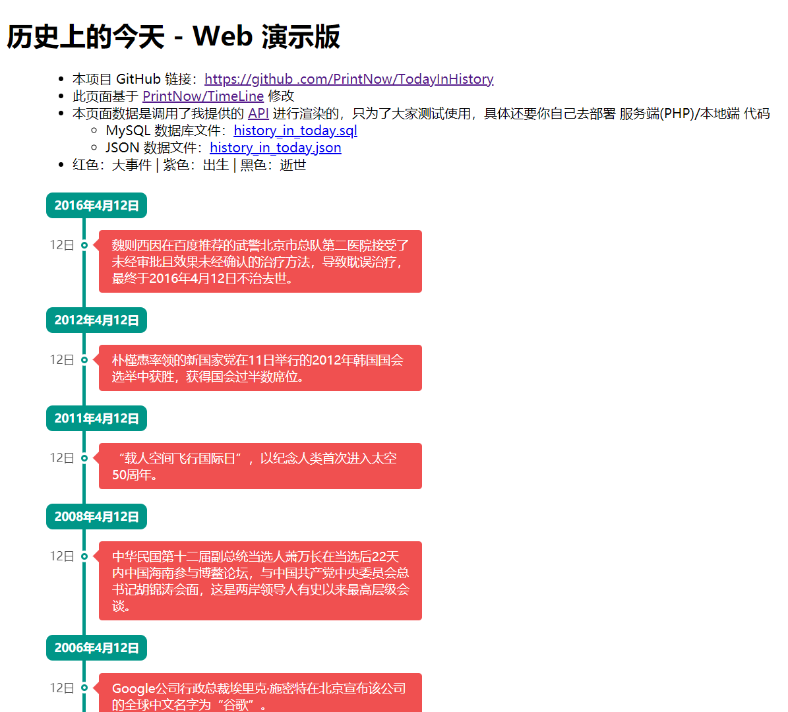

# 🕘 TodayInHistory | 历史上的今天
历史上的今天数据库，数据源于“维基百科”，演示地址：[https://api.nowtime.cc/today_in_history.html](https://api.nowtime.cc/today_in_history.html)

## 说一下爬虫思路
1. 先下载 `https://zh.wikipedia.org/wiki/1月1日` 
到 `https://zh.wikipedia.org/wiki/12月31日` 366天的页面（我用了 3分钟 左右全部下载完成）
2. 然后写代码（~~用的世界上最好的语言~~ PHP）进行数据清洗，这步我花了好久，大概两三个小时（惭愧惭愧，水平有限😑）
3. 清洗完成后导出为 [history_in_today.json](history_in_today.json) 文件
4. 然后写代码（~~用的世界上最好的语言~~ PHP）将其批量插入 MySQL数据库
5. 写 API 逻辑代码，我用的 ThinkPHP 框架，接口地址：[https://api.nowtime.cc/v1/today_in_history](https://api.nowtime.cc/v1/today_in_history)
6. 然后根据我之前写的 [PrintNow/TimeLine](https://github.com/PrintNow/TimeLine) 时间线，修改成了 [index.html](index.html)
7. 然后你就看到了本项目


# 🧀 使用方法
> 我准备了两份数据 [history_in_today.sql](history_in_today.sql) 和 [history_in_today.json](history_in_today.json)
> 你可以随意发挥，或使用我写好的，如下👇

1. 准备一个 PHP 环境
2. [下载源码](https://github.com/PrintNow/TodayInHistory/archive/master.zip)，解压后**放置网站根目录**
3. 将 `history_in_today.sql` 导入 `MySQL 数据库`
4. 配置好数据库信息，在 `api.php` 第 14~17 行
5. 修改 [static/script.js]() 第3行，将 `https://api.nowtime.cc/v1/today_in_history` 替换成 `http://你的域名/api.php`
6. 打开 `http://你的域名/index.html`
7. enjoy 😋

# 🖼 截图


# API 字段说明
|字段|类型|说明|
|---|---|---|
|code|int|[必有] 状态码，正常返回 `200`，其它包括数据不存在都返回如 500、-1|
|msg|string|[必有] 信息，正常返回 `ok`，非 `200` 状态码返回**错误原因**|
|count|int|历史上的今天返回数量|
|disclaimer|string|[必有] 免责声明，可以自己在 `api.php` 第82行 进行修改|
|data|array|历史上的今天 数据，字段说明请看下方|
|---|---|---|
|year|int|[必有] 年份，如果前面带有有负号 `-`，则代表是**公元前**|
|month|int|[必有] 月份|
|type|int|[必有] 事件类型，1：大事件，2：出生，3：逝世|
|data|string|[必有] 事件信息，如果当天有多个事件，将以 `${{delimiter}}` 作为分隔符进行分割。PHP 可以使用 `explode()` 函数进行分割，JavaScript 可以使用 `split` 方法进行分割|

```
{
	"code": 200,
	"msg": "ok",
	"count": 2,
	"disclaimer": "数据源于“维基百科”，经过加工后为您呈现本数据，数据采集于 2020\/04\/12 12:00，在此之后一些数据可能发生了改变，请以事实为准！本站不承担任何因数据改变而造成的任何责任",
	"data": [{
		"year": 2020,
		"month": 1,
		"day": 1,
		"type": 3,
		"data": "大卫·斯特恩，前任美国国家篮球协会总裁（1942年出生）"
	}, {
		"year": 2019,
		"month": 1,
		"day": 1,
		"type": 1,
		"data": "中华民国实施大型餐饮业如连锁速食店等，内用将禁止提供塑胶吸管的规定[3][4]；中华民国依法届期终止第三代行动通讯（3G）业务。"
	}]
}
```